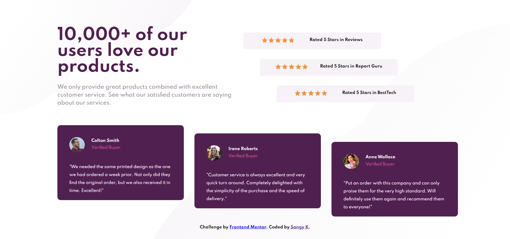

# Frontend Mentor - Social proof section
**Desinged by [Sangy K](https://github.com/sansk) for [Frontend Mentor](https://www.frontendmentor.io) Challenge**

View the [Completed Page here.](https://social-proof-section-frontendmentor-chi.vercel.app/)

## Used

CSS Flexbox, CSS Grid and CSS Variables.

**Feedback is always welcome**
